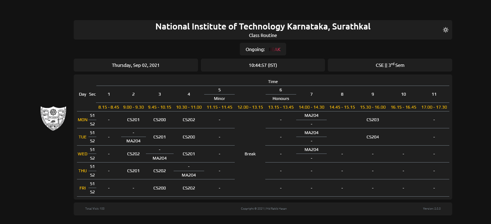

# Class Routine   
Static website. Currently, it is showing date, day and Indian Standard Time and according to the day and time class status will be shown, selected in the table. 

Live preview - https://class-routine.vercel.app/

###Screenshot

-v2.0.0

-v1.0.0

Code is totally messed up here, I have some plan with this project. I will fix everything that time.  
